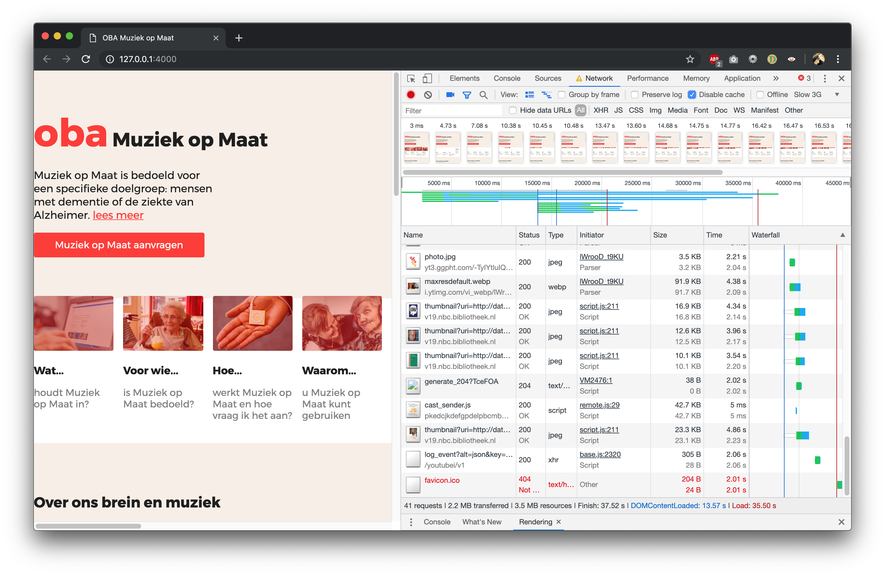
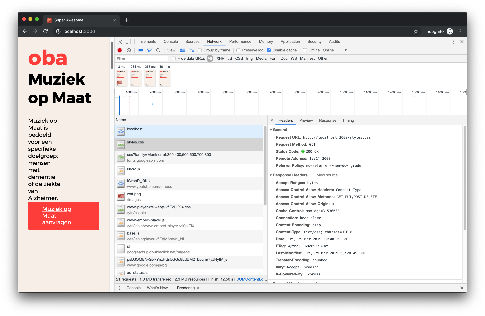
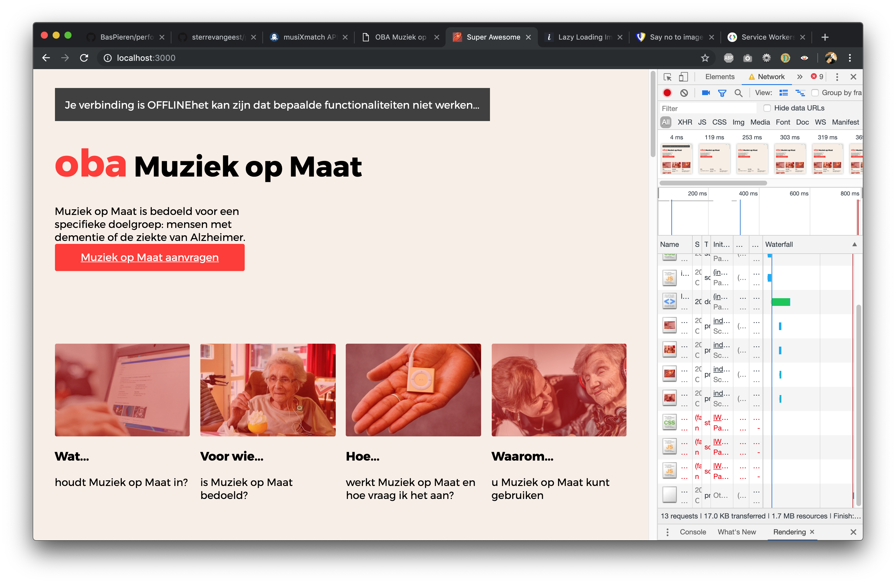
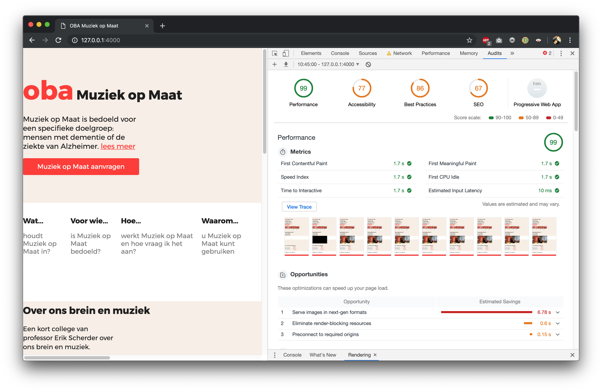
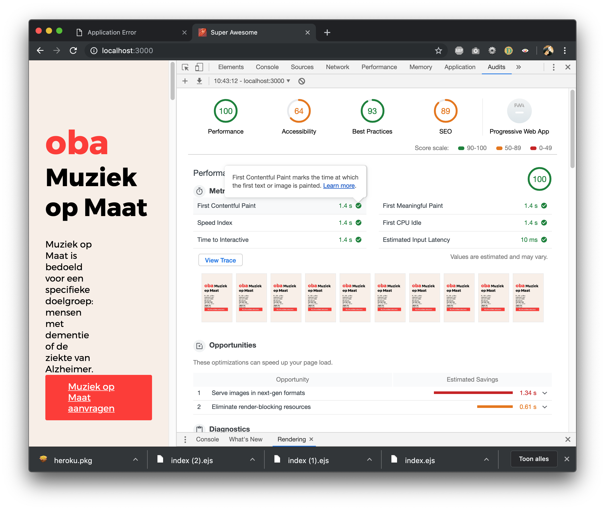

**🎓 Performance Matters @cmda-minor-web · 2018-2019**

# Performance Matters for [OBA Muziek op Maat ](https://github.com/sterrevangeest/project-1-1819)

I tested and improved the performance for the app [OBA Muziek op Maat ](https://github.com/sterrevangeest/project-1-1819).



<!-- ## Week 1 -->

## Installing

```
git clone https://github.com/sterrevangeest/performance-matters-1819.git

cd performance-matters-1819

npm install

npm start
```

<!-- ## API

Ik heb gebruik gemaakt van de [MusiXmatch API](https://rapidapi.com/musixmatch.com/api/musixmatch) en de OBA api. -->

<!-- ## Week 2 -->

### Performance on the client-side


> SLOW 3G / Disable Cache

<!-- ### Week 3 -->

## Performance

What I did to upgrade the perfomance of my app:

### Lazy loading

A lot of images are loaded on the bottom of the page. These images are "non-critical". So I don't want these images to load when they are not in the viewport.

In my html file I created an `` tag with `data-src`. To make sure the browser knows the dimensions of the not yet loaded image I gave the html tag an `width` and `height`.

```js
// bron: https://imagekit.io/blog/lazy-loading-images-complete-guide/
document.addEventListener("DOMContentLoaded", function() {
  var lazyloadImages;

  if ("IntersectionObserver" in window) {
    lazyloadImages = document.querySelectorAll(".lazy");
    var imageObserver = new IntersectionObserver(function(entries, observer) {
      entries.forEach(function(entry) {
        if (entry.isIntersecting) {
          var image = entry.target;
          image.src = image.dataset.src;
          image.classList.remove("lazy");
          imageObserver.unobserve(image);
        }
      });
    });

    lazyloadImages.forEach(function(image) {
      imageObserver.observe(image);
    });
  } else {
    var lazyloadThrottleTimeout;
    lazyloadImages = document.querySelectorAll(".lazy");

    function lazyload() {
      if (lazyloadThrottleTimeout) {
        clearTimeout(lazyloadThrottleTimeout);
      }

      lazyloadThrottleTimeout = setTimeout(function() {
        var scrollTop = window.pageYOffset;
        lazyloadImages.forEach(function(img) {
          if (img.offsetTop < window.innerHeight + scrollTop) {
            img.src = img.dataset.src;
            img.classList.remove("lazy");
          }
        });
        if (lazyloadImages.length == 0) {
          document.removeEventListener("scroll", lazyload);
          window.removeEventListener("resize", lazyload);
          window.removeEventListener("orientationChange", lazyload);
        }
      }, 20);
    }

    document.addEventListener("scroll", lazyload);
    window.addEventListener("resize", lazyload);
    window.addEventListener("orientationChange", lazyload);
  }
});
```

### Say no to image reflow..

Image reflow is annoying, so I made sure the page won't reflow when a image is fully loaded.

In my html file I created an `` tag. To make sure the text below the image won't reflow, I gave the html tag an `width` and `height`. To make sure this works for every device: The `padding-bottom` property is used to define the height as a percentage of its width.

```html
<div class="image-fix">
  
</div>
```

```css
.image-fix {
  padding-bottom: 23vh;
  background-color: grey;
  height: 0;
  width: 100%;
}

img {
  height: 10em;
}
```

### Minify

To minify my CSS I created a task that minifies my CSS with `gulp-cssnano`.

```js
const gulp = require("gulp");
const cssnano = require("gulp-cssnano");
const concat = require("gulp-concat");
const baseDir = "static/";

gulp
  .src([baseDir + "styles.css"])
  .pipe(concat("styles-minify.css"))
  .pipe(cssnano({ discardComments: { removeAll: true } }))
  .pipe(gulp.dest("static/minified"));
```

I run this task and link the minified css-file in my html.

To minify my HTML I use `express-minify-html`:

```js
var minifyHTML = require("express-minify-html");
app.use(
  minifyHTML({
    override: true,
    exception_url: false,
    htmlMinifier: {
      removeComments: true,
      collapseWhitespace: true,
      collapseBooleanAttributes: true,
      removeAttributeQuotes: true,
      removeEmptyAttributes: true,
      minifyJS: true
    }
  })
);
```

### Compression

Compression is a Node.js middleware. It compresses the responses from the server.

```js
var compression = require("compression");
app.use(compression());
```



### Caching

Before I used a service worker I cached my files like this:.

```js
app.use((req, res, next) => {
  res.append("Access-Control-Allow-Origin", ["*"]);
  res.append("Access-Control-Allow-Methods", "GET,PUT,POST,DELETE");
  res.append("Access-Control-Allow-Headers", "Content-Type");
  res.append("Cache-Control", "max-age=" + 365 * 24 * 60 * 60);
  next();
});
```

#### Service Worker

Later I added an service worker. A service worker is a script that your browser runs in the background, separate from a web page, opening the door to features that don't need a web page or user interaction.

I made sure the user can still read my website even tough they are offline.



## Audit

Audit results:

Before:



After:


